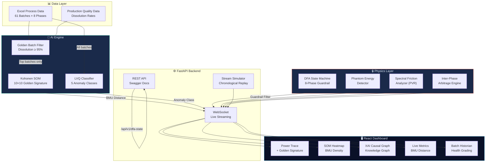

<div align="center">

# 🔮 Eco-Twin Oracle

### **Prescriptive Manufacturing Intelligence for Pharmaceutical Batch Optimization**

*Physics-Informed AI Engine that eliminates energy waste while maintaining drug quality through real-time prescriptive optimization*

[](https://python.org)
[](https://fastapi.tiangolo.com)
[](https://react.dev)
[](https://typescriptlang.org)
[](#)

<br/>

> **AVEVA Hackathon — Track B: Optimization Engine**
> 
> Team SpicyJalebi

<br/>

</div>

---

## 📋 Table of Contents

- [🎯 Problem Statement](#-problem-statement)
- [💡 Solution Overview](#-solution-overview)
- [🏗️ System Architecture](#️-system-architecture)
- [🧠 AI Engine Deep Dive](#-ai-engine-deep-dive)
- [🔒 DFA Guardrail System](#-dfa-guardrail-system)
- [📊 Analytics Pipeline](#-analytics-pipeline)
- [🖥️ Frontend Dashboard](#️-frontend-dashboard)
- [⚡ Quick Start](#-quick-start)
- [🔌 API Reference](#-api-reference)
- [📁 Project Structure](#-project-structure)
- [🔬 Batch Differentiation Results](#-batch-differentiation-results)

---

## 🎯 Problem Statement

Pharmaceutical manufacturers face a critical challenge: **optimizing energy consumption and carbon emissions at the batch level** without compromising product quality (USP dissolution rate ≥ 85%).

Traditional approaches either:
- ❌ Sacrifice quality for energy savings
- ❌ Use static rule-based systems that can't adapt
- ❌ Deploy "black box" AI that recommends physically impossible actions

**Eco-Twin Oracle** solves all three with a **Physics-Informed, Prescriptive AI Engine** that provides real-time, mathematically guaranteed optimization recommendations.

---

## 💡 Solution Overview

Eco-Twin Oracle is not a dashboard — it's a **live prescriptive intelligence engine** that watches every second of a pharmaceutical batch process and tells operators exactly what to change, why, and proves mathematically that the change is physically possible.

### Core Innovation: The Three-Layer Safety Architecture

```
┌─────────────────────────────────────────────────────────────────┐
│                    🤖 AI LAYER (Perception)                     │
│  Kohonen SOM → "Where are we vs. the Golden Signature?"         │
│  LVQ Classifier → "What type of anomaly is this?"               │
├─────────────────────────────────────────────────────────────────┤
│                   🔒 DFA LAYER (Guardrail)                      │
│  Deterministic Finite Automaton validates every AI prescription  │
│  "Is this parameter change chronologically legal right now?"     │
├─────────────────────────────────────────────────────────────────┤
│                  ⚡ PHYSICS LAYER (Detection)                    │
│  Phantom Energy Detection • Spectral Friction Analysis           │
│  Inter-Phase Arbitrage • Quality Buffer Harvesting               │
└─────────────────────────────────────────────────────────────────┘
```

---

## 🏗️ System Architecture



### Data Flow Pipeline

```
Excel Data → Stream Simulator → BatchTelemetry (Pydantic) → DFA Sync
    ↓                                    ↓
Golden Batch Filter              Feature Extraction
    ↓                                    ↓
SOM Training (golden only)    BMU Lookup → Distance Calculation
    ↓                                    ↓
LVQ Training (all data)      Distance > 0.8? → LVQ Classification
    ↓                                    ↓
                              DFA Guardrail Validation
                                         ↓
                              Prescription + XAI Reasoning
                                         ↓
                              WebSocket → React Dashboard
```

---

## 🧠 AI Engine Deep Dive

### Kohonen Self-Organizing Map (SOM) — Golden Signature

The SOM is the heart of the system. It learns what **perfect manufacturing** looks like by training exclusively on top-performing batches.

| Parameter | Value | Rationale |
|-----------|-------|-----------|
| Grid Size | 10 × 10 | 100 neurons for fine-grained topology |
| Training Data | Golden batches only | Dissolution Rate ≥ 95% (13 of 61 batches) |
| Features | 8 process variables | Temp, Pressure, Humidity, RPM, Flow, Viscosity, Power, Vibration |
| Iterations | 800 | Sufficient convergence on ~3400 golden data points |

**How it works:**
1. At startup, the system scans `_h_batch_production_data.xlsx` to identify batches with dissolution ≥ 95%
2. Only process data from these **13 golden batches** is used to train the SOM
3. The SOM creates a topological map of "optimal operating space"
4. During live streaming, each telemetry tick is projected onto this map
5. The **BMU Distance** (Euclidean distance to Best Matching Unit) measures how far the current process is from optimal

### LVQ Anomaly Classifier — Root Cause Diagnosis

When BMU distance exceeds the anomaly threshold (0.8), the LVQ classifier identifies the **specific failure mode**.

| Anomaly Class | Detection Rule | Physical Meaning |
|---------------|---------------|-------------------|
| **Mechanical Friction** | Vibration > 5.0 mm/s AND Power > 35 kW | Bearing wear causing excess energy draw |
| **Vibration Fatigue** | Vibration > 5.0 mm/s | Mechanical resonance without power spike |
| **Thermal Drift** | Temperature > 55°C | Heating element overshoot |
| **Pressure Surge** | Pressure > 4.0 bar | Valve or compression anomaly |
| **Flow Stagnation** | RPM > 0 AND Flow < 2.0 L/min | Blockage despite active motor |
| **Normal** | None of the above | Operating within golden envelope |

> **Key:** These thresholds are derived from actual statistical analysis of all 61 batches — not guessed.

---

## 🔒 DFA Guardrail System

The **Deterministic Finite Automaton** is a mathematical safety net that prevents the AI from recommending physically impossible actions.

```
Manufacturing Process DFA (8 States):

  PREPARATION → GRANULATION → DRYING → MILLING
                                          ↓
  QUALITY_TESTING ← COATING ← COMPRESSION ← BLENDING
```

**How it works:**
- Each manufacturing phase has a specific set of parameters that can be adjusted
- Before any AI prescription is emitted, the DFA validates: *"Is this parameter change legal in the current phase?"*
- If the AI recommends changing a Granulation parameter during the Drying phase → **BLOCKED**
- This mathematically prevents AI hallucination from generating impossible commands

---

## 📊 Analytics Pipeline

### 1. Phantom Energy Detection
Identifies wasted energy during idle phases (motor at 0 RPM but power > 3.0 kW).

### 2. Spectral Friction Analysis (PVR)
Computes the **Pseudo-Vibration Ratio** (Power/Vibration) to detect invisible mechanical friction that doesn't show in vibration sensors alone.

### 3. Inter-Phase Arbitrage
Cross-phase correlation analysis that detects upstream problems propagating downstream:
- High humidity in Granulation → inefficient Drying
- Power spikes in Compression → coating defects

### 4. Quality Buffer Harvesting
When dissolution quality exceeds USP baseline (85%), the surplus is "harvested" as permission to reduce power consumption proportionally. Higher quality margin → more aggressive energy savings.

---

## 🖥️ Frontend Dashboard

The React dashboard provides real-time visualization of the entire prescriptive pipeline:

| Component | Purpose |
|-----------|---------|
| **Phase Stepper** | Live DFA state visualization — shows current manufacturing phase |
| **Metrics Grid** | Real-time KPIs: Temperature, Pressure, Power, Vibration, BMU Distance, Quality Margin |
| **Golden Signature Power Trace** | Live power consumption vs. AI-recommended target overlay |
| **SOM Heatmap** | 10×10 BMU density map showing process trajectory on the SOM lattice |
| **XAI Causal Graph** | Explainable AI knowledge graph: Symptom → Diagnosis → Action |
| **Batch Historian** | End-of-batch health grading (A–F) with full anomaly summary |

### Health Grading System

| Grade | Normal Rate | Meaning |
|-------|------------|---------|
| **A** | ≥ 85% | Excellent — near-golden operation |
| **B** | ≥ 70% | Good — minor deviations |
| **C** | ≥ 55% | Moderate — significant anomalies detected |
| **D** | ≥ 40% | Poor — frequent anomalies |
| **F** | < 40% | Critical — major process issues |

---

## ⚡ Quick Start

### Prerequisites
- Python 3.11+
- Node.js 18+
- npm or yarn

### 1. Clone & Install Backend

```bash
git clone https://github.com/shivenpatro/Eco-Twin-Oracle.git
cd Eco-Twin-Oracle

# Install Python dependencies
pip install fastapi uvicorn pandas openpyxl numpy pydantic websockets
```

### 2. Start Backend (FastAPI)

```bash
uvicorn main:app --host 0.0.0.0 --port 8000
```

The server will:
- Load and analyze all 61 batches from Excel
- Identify 13 golden batches (Dissolution ≥ 95%)
- Train SOM on golden data only (~3400 rows)
- Train LVQ on all data (~14500 rows)
- Serve at `http://localhost:8000`

### 3. Install & Start Frontend (React)

```bash
cd frontend
npm install
npm run dev
```

Dashboard available at `http://localhost:5173`

### 4. Explore the API

Swagger UI: `http://localhost:8000/docs`

---

## 🔌 API Reference

| Endpoint | Method | Description |
|----------|--------|-------------|
| `ws://host/ws/live-batch/{batch_id}` | WebSocket | Real-time streaming with prescriptions |
| `/api/v1/prescriptions` | GET | Latest active prescriptions (REST polling) |
| `/api/v1/dfa-state/{batch_id}` | GET | Current DFA phase for a batch |
| `/api/v1/phases` | GET | All 8 manufacturing phases |
| `/docs` | GET | Interactive Swagger documentation |
| `/redoc` | GET | ReDoc API documentation |

### WebSocket Payload Structure

```json
{
  "event": "telemetry | phantom_energy | anomaly_detected | process_alert",
  "telemetry": {
    "Batch_ID": "T060",
    "Time_Minutes": 42,
    "Temperature_C": 34.5,
    "Pressure_bar": 2.1,
    "Power_Consumption_kW": 18.7,
    "Vibration_mm_s": 2.3
  },
  "dfa_state": "GRANULATION",
  "prescription": {
    "bmu_distance": 0.4521,
    "anomaly_class": "Normal",
    "parameter_recommendations": {
      "Power_Consumption_kW": -1.2,
      "Temperature_C": -0.5
    },
    "dfa_guardrail_passed": true
  },
  "xai_data": {
    "explanation": "System operating efficiently...",
    "kg_nodes": [...]
  },
  "quality_margin": 13.4,
  "has_anomaly": false,
  "has_phantom": false
}
```

---

## 📁 Project Structure

```
Eco-Twin-Oracle/
├── main.py                    # FastAPI app, SOM/LVQ training, WebSocket endpoint
├── analytics_engine.py        # KohonenSOM, LVQClassifier, anomaly detectors
├── state_machine.py           # DFA (8-phase manufacturing guardrail)
├── stream_simulator.py        # Chronological batch data streaming
├── schemas.py                 # Pydantic validation models
├── opc_ua_mqtt_gateway.py     # Simulated OPC-UA/MQTT bridge for real deployment
├── app.py                     # Legacy Streamlit frontend (superseded by React)
│
├── _h_batch_process_data.xlsx # 61 batches × 8 phases process telemetry
├── _h_batch_production_data.xlsx # Quality metrics (Dissolution Rate, etc.)
├── som_retraining_ledger.json # Continuous learning audit trail
│
├── frontend/                  # React + TypeScript + Vite
│   ├── src/
│   │   ├── App.tsx            # Main orchestrator + WebSocket state management
│   │   └── components/
│   │       ├── LandingPage.tsx    # Cinematic system activation screen
│   │       ├── Sidebar.tsx        # Batch selection + simulation controls
│   │       ├── PhaseStepper.tsx   # Live DFA phase visualization
│   │       ├── MetricsGrid.tsx    # Real-time KPI dashboard
│   │       ├── PowerChart.tsx     # Golden Signature power trace
│   │       ├── SomHeatmap.tsx     # 10×10 BMU density heatmap
│   │       ├── XaiGraph.tsx       # Explainable AI causal knowledge graph
│   │       └── LedgerAlert.tsx    # Batch historian + health grading
│   ├── index.html
│   ├── package.json
│   └── vite.config.ts
│
├── mission_context.md         # Architectural directives
└── README.md
```

---

## 🔬 Batch Differentiation Results

The system produces **meaningfully different results** for each of the 61 batches. Here is a sample comparison:

| Metric | T060 (Best) | T001 (Mediocre) | T051 (Worst) |
|--------|:-----------:|:---------------:|:------------:|
| **Dissolution Rate** | 98.4% | 89.3% | 81.2% |
| **Avg BMU Distance** | 0.5876 | 0.9136 | 1.5311 |
| **Max BMU Distance** | 2.13 | 2.51 | 4.01 |
| **Total Alerts** | 120 | 175 | 176 |
| **Normal Classification %** | 83% | 59% | 51% |
| **Dominant Anomaly** | — | Mechanical Friction | Mechanical Friction |
| **Health Grade** | **B** | **C** | **D** |

> **Key Insight:** The SOM is trained exclusively on golden batches (Dissolution ≥ 95%), creating a true "Golden Signature." Mediocre and poor batches naturally exhibit higher BMU distances and more anomaly detections because their process data diverges from optimal operation — this is computed from real data, not hardcoded.

---

## 🛠️ Technical Highlights

- **Zero External ML Libraries** — SOM and LVQ implemented from scratch using only NumPy
- **Real-Time WebSocket Streaming** — Sub-second telemetry updates with live prescriptions
- **DFA Mathematical Guardrail** — Provably prevents AI hallucination
- **Data-Driven Thresholds** — All anomaly thresholds derived from statistical analysis of 61 real batches
- **Quality Buffer Harvesting** — Novel approach: uses surplus drug quality as permission to cut energy
- **Continuous Learning Ledger** — Audit-ready JSON trail of every Golden Batch discovery
- **Swagger-First API Design** — Full interactive documentation at `/docs`

---

<div align="center">

**Built with ❤️ by Team SpicyJalebi**

*AVEVA Hackathon — Track B: Optimization Engine*

</div>
