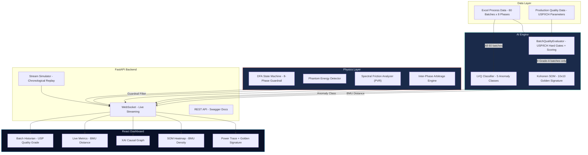

<div align="center">

# Eco-Twin Oracle

### Prescriptive Manufacturing Intelligence for Pharmaceutical Batch Optimization

*Physics-Informed AI Engine that eliminates energy waste while maintaining drug quality through real-time prescriptive optimization*

[](https://python.org)
[](https://fastapi.tiangolo.com)
[](https://react.dev)
[](https://typescriptlang.org)
[](#)

<br/>

> **AVEVA Hackathon — Track B: Optimization Engine**
>
> Team SpicyJalebi

<br/>

</div>

---

## Table of Contents

- [Problem Statement](#problem-statement)
- [Solution Overview](#solution-overview)
- [System Architecture](#system-architecture)
- [AI Engine Deep Dive](#ai-engine-deep-dive)
- [DFA Guardrail System](#dfa-guardrail-system)
- [Analytics Pipeline](#analytics-pipeline)
- [Frontend Dashboard](#frontend-dashboard)
- [Quick Start](#quick-start)
- [API Reference](#api-reference)
- [Project Structure](#project-structure)
- [Batch Evaluation Results](#batch-evaluation-results)

---

## Problem Statement

Pharmaceutical manufacturers face a critical challenge: **optimizing energy consumption and carbon emissions at the batch level** without compromising product quality (USP dissolution rate >= 85%).

Traditional approaches either:
- Sacrifice quality for energy savings
- Use static rule-based systems that cannot adapt
- Deploy "black box" AI that recommends physically impossible actions

**Eco-Twin Oracle** solves all three with a **Physics-Informed, Prescriptive AI Engine** that provides real-time, mathematically guaranteed optimization recommendations.

---

## Solution Overview

Eco-Twin Oracle is not a dashboard — it is a **live prescriptive intelligence engine** that watches every second of a pharmaceutical batch process and tells operators exactly what to change, why, and proves mathematically that the change is physically possible.

### Core Innovation: The Three-Layer Safety Architecture

```
+------------------------------------------------------------------+
|                    AI LAYER (Perception)                         |
|  Kohonen SOM  ->  "Where are we vs. the Golden Signature?"       |
|  LVQ Classifier  ->  "What type of anomaly is this?"             |
+------------------------------------------------------------------+
|                   DFA LAYER (Guardrail)                          |
|  Deterministic Finite Automaton validates every AI prescription  |
|  "Is this parameter change chronologically legal right now?"     |
+------------------------------------------------------------------+
|                  PHYSICS LAYER (Detection)                       |
|  Phantom Energy Detection  |  Spectral Friction Analysis         |
|  Inter-Phase Arbitrage  |  Quality Buffer Harvesting             |
+------------------------------------------------------------------+
```

---

## System Architecture



### Data Flow Pipeline

```
Excel Data  ->  Stream Simulator  ->  BatchTelemetry (Pydantic)  ->  DFA Sync
    |                                           |
    |                                   Feature Extraction
    |                                           |
Golden Batch Filter                    BMU Lookup + Distance
(USP/ICH hard gates                            |
 + composite >= 88)             Distance > 1.8?  ->  LVQ Classification
    |                                           |
SOM Training (9 golden batches)       DFA Guardrail Validation
LVQ Training (all 60 batches)                  |
                                    Prescription + XAI Reasoning
                                               |
                             BatchQualityEvaluator (end of batch)
                                               |
                                      WebSocket  ->  React Dashboard
```

---

## AI Engine Deep Dive

### Kohonen Self-Organizing Map (SOM) — Golden Signature

The SOM is the heart of the system. It learns what **perfect manufacturing** looks like by training exclusively on truly golden batches — those passing ALL USP/ICH regulatory hard gates with composite quality score >= 88.

| Parameter | Value | Rationale |
|-----------|-------|-----------|
| Grid Size | 10 x 10 | 100 neurons for fine-grained topology |
| Training Data | 9 Grade-A golden batches only | Passes all USP/ICH hard gates + composite >= 88 |
| Features | 8 process variables | Temp, Pressure, Humidity, RPM, Compression, Flow, Power, Vibration |
| Iterations | 800 | Sufficient convergence on ~2000 golden data points |

**How it works:**
1. At startup, `BatchQualityEvaluator` runs all 6 USP/ICH hard gate checks on every batch
2. Only the 9 batches that pass ALL gates AND score >= 88 composite are used as golden
3. The SOM creates a topological map of "optimal operating space"
4. During live streaming, each telemetry tick is projected onto this map
5. The **BMU Distance** (Euclidean distance to Best Matching Unit) measures deviation from optimal

**Critical design decision:** Training the SOM on batches selected by dissolution rate alone (>= 95%) selects Grade-F USP rejects with failed Friability and Content Uniformity. The Golden Signature would be contaminated. This bug is explicitly corrected here.

### LVQ Anomaly Classifier — Root Cause Diagnosis

When BMU distance exceeds the anomaly threshold (1.8), the LVQ classifier identifies the **specific failure mode**.

| Anomaly Class | Detection Rule | Physical Meaning |
|---------------|---------------|-------------------|
| **Mechanical Friction** | Vibration > 7.76 mm/s AND Power > 55.9 kW | Bearing wear causing excess energy draw |
| **Vibration Fatigue** | Vibration > 7.76 mm/s | Mechanical resonance without power spike |
| **Thermal Drift** | Temperature > 61.5 C | Heating element overshoot |
| **Pressure Surge** | Pressure > 1.247 bar | Valve or compression anomaly |
| **Flow Stagnation** | RPM > 0 AND Flow < 0.5 L/min | Blockage despite active motor |
| **Normal** | None of the above | Operating within golden envelope |

All thresholds are calibrated from actual dataset statistics (mean + 2 standard deviations across all 60 batches), not arbitrary magic numbers.

---

## DFA Guardrail System

The **Deterministic Finite Automaton** is a mathematical safety net that prevents the AI from recommending physically impossible actions.

```
Manufacturing Process DFA (8 States):

  PREPARATION -> GRANULATION -> DRYING -> MILLING
                                              |
  QUALITY_TESTING <- COATING <- COMPRESSION <- BLENDING
```

**How it works:**
- Each manufacturing phase has a specific set of parameters that can be adjusted
- Before any AI prescription is emitted, the DFA validates: "Is this parameter change legal in the current phase?"
- If the AI recommends changing a Granulation parameter during the Drying phase — BLOCKED
- This mathematically prevents AI hallucination from generating impossible commands
- Implemented as IntEnum comparison: parameter's native phase > current state = physical violation

---

## Analytics Pipeline

### 1. Phantom Energy Detection
Identifies wasted energy during idle phases (motor at 0 RPM but power > 3.0 kW during PREPARATION).

### 2. Spectral Friction Analysis (PVR)
Computes the **Pseudo-Vibration Ratio** (Power / Vibration) to detect invisible mechanical friction that does not show in vibration sensors alone. Threshold: PVR > 12.0 with motor running.

### 3. Inter-Phase Arbitrage
Cross-phase correlation analysis that detects upstream problems propagating downstream:
- High humidity in Granulation -> inefficient Drying
- Temperature overshoot in Drying -> moisture carryover into Milling
- Power spikes in Compression -> coating thermal carryover

### 4. Quality Buffer Harvesting
When dissolution quality exceeds USP baseline (85%), the surplus margin is used to reduce power consumption proportionally. Higher quality margin (up to 1.5 kW reduction) -> more aggressive energy savings without quality risk.

---

## Frontend Dashboard

The React dashboard provides real-time visualization of the entire prescriptive pipeline:

| Component | Purpose |
|-----------|---------|
| **Phase Stepper** | Live DFA state — shows current manufacturing phase with progress |
| **Metrics Grid** | Real-time KPIs: Temperature, Pressure, Power, Vibration, BMU Distance, PVR, Quality Margin |
| **Golden Signature Power Trace** | Live power consumption vs. AI-recommended target overlay |
| **SOM Heatmap** | 10x10 BMU density map showing process trajectory on the SOM lattice |
| **XAI Causal Graph** | Explainable AI knowledge graph: Symptom -> Diagnosis -> Action |
| **Batch Historian** | End-of-batch USP quality grade (A-F) with hard gate failure details and parameter scores |

### Quality Grading System (USP/ICH-Compliant)

The grade is derived from `BatchQualityEvaluator`, not from process telemetry similarity.

| Grade | Composite Score | Hard Gates | Decision |
|-------|----------------|------------|----------|
| **A** | >= 88 | All pass | ACCEPT EXCELLENT |
| **B** | 78 - 87.9 | All pass | ACCEPT GOOD |
| **C** | 68 - 77.9 | All pass | CONDITIONAL RELEASE |
| **D** | 58 - 67.9 | All pass | REVIEW REQUIRED |
| **F** | Any | Any failure | REJECT |

The composite score = 0.90 x Quality Score (7 weighted parameters) + 0.10 x Efficiency Score (fleet-normalised power + duration).

---

## Quick Start

### Prerequisites
- Python 3.11+
- Node.js 18+
- npm

### 1. Clone and Install Backend

```bash
git clone https://github.com/shivenpatro/Eco-Twin-Oracle.git
cd Eco-Twin-Oracle

pip install -r requirements.txt
```

### 2. Start Backend (FastAPI)

```bash
python main.py
```

The server will:
- Evaluate all 60 batches against USP/ICH hard gates and compute composite scores
- Identify 9 truly golden batches (all hard gates pass + composite >= 88)
- Train SOM on golden data only (~2055 rows from 9 batches)
- Train LVQ on all data (~14500 rows from 60 batches)
- Pre-load full quality parameter cache for accurate end-of-batch verdicts
- Serve at `http://localhost:8000`

### 3. Install and Start Frontend (React)

```bash
cd frontend
npm install
npm run dev
```

Dashboard available at `http://localhost:5173`

### 4. Explore the API

Swagger UI: `http://localhost:8000/docs`

---

## API Reference

| Endpoint | Method | Description |
|----------|--------|-------------|
| `ws://host/ws/live-batch/{batch_id}` | WebSocket | Real-time streaming with prescriptions |
| `/api/v1/active-prescriptions` | GET | Latest active prescriptions for all streaming batches |
| `/api/v1/dfa-state/{batch_id}` | GET | Current DFA phase for a batch |
| `/api/v1/phases` | GET | All 8 manufacturing phases |
| `/health` | GET | Liveness probe — SOM/LVQ readiness |
| `/docs` | GET | Interactive Swagger documentation |
| `/redoc` | GET | ReDoc API documentation |

### WebSocket Payload Structure

```json
{
  "event": "telemetry | phantom_energy | anomaly_detected | process_alert",
  "telemetry": {
    "Batch_ID": "T001",
    "Time_Minutes": 42,
    "Temperature_C": 34.5,
    "Pressure_Bar": 0.98,
    "Power_Consumption_kW": 18.7,
    "Vibration_mm_s": 2.3
  },
  "dfa_state": "GRANULATION",
  "prescription": {
    "bmu_distance": 0.4521,
    "anomaly_class": "Normal",
    "parameter_recommendations": {
      "Power_Consumption_kW": -1.2,
      "Temperature_C": -0.5
    },
    "dfa_guardrail_passed": true
  },
  "xai_data": {
    "explanation": "System operating efficiently...",
    "kg_nodes": [...]
  },
  "quality_margin": 4.3,
  "has_anomaly": false,
  "has_phantom": false
}
```

### batch_complete Payload

```json
{
  "event": "batch_complete",
  "ledger_status": {
    "grade": "A",
    "decision": "ACCEPT_EXCELLENT",
    "composite_score": 89.09,
    "hard_gate_passed": true,
    "hard_gate_failures": [],
    "per_param_scores": { "Dissolution_Rate": 85, "Hardness": 100, "Friability": 85 },
    "trigger_som_retraining": true
  },
  "batch_summary": {
    "quality_grade": "A",
    "quality_decision": "ACCEPT_EXCELLENT",
    "quality_composite": 89.09,
    "hard_gate_failures": [],
    "process_stability_pct": 91.4,
    "avg_power_kW": 21.82,
    "peak_power_kW": 58.3
  }
}
```

---

## Project Structure

```
Eco-Twin-Oracle/
|-- main.py                      # FastAPI app, startup training, WebSocket endpoint
|-- analytics_engine.py          # KohonenSOM, LVQClassifier, BatchQualityEvaluator
|-- state_machine.py             # DFA (8-phase manufacturing guardrail)
|-- stream_simulator.py          # Chronological batch data streaming (JSD pattern)
|-- schemas.py                   # Pydantic validation models (physics constraints)
|-- opc_ua_mqtt_gateway.py       # Simulated OPC-UA/MQTT bridge for real deployment
|-- extract_thresholds.py        # Diagnostic: verify threshold calibration from data
|-- test_distances.py            # Diagnostic: validate SOM golden vs. reject separation
|-- app.py                       # Legacy Streamlit frontend (superseded by React)
|
|-- _h_batch_process_data.xlsx   # 60 batches x 8 phases process telemetry
|-- _h_batch_production_data.xlsx# Quality metrics (Dissolution, Friability, CU, etc.)
|-- som_retraining_ledger.json   # Continuous learning audit trail
|-- requirements.txt
|
|-- frontend/                    # React + TypeScript + Vite
|   |-- src/
|   |   |-- App.tsx              # Main orchestrator + WebSocket state management
|   |   |-- components/
|   |       |-- LandingPage.tsx  # Cinematic system activation screen
|   |       |-- Sidebar.tsx      # Batch selection + simulation controls
|   |       |-- PhaseStepper.tsx # Live DFA phase visualization
|   |       |-- MetricsGrid.tsx  # Real-time KPI dashboard
|   |       |-- PowerChart.tsx   # Golden Signature power trace (Recharts)
|   |       |-- SomHeatmap.tsx   # 10x10 BMU density heatmap
|   |       |-- XaiGraph.tsx     # Explainable AI causal knowledge graph (ReactFlow)
|   |       |-- LedgerAlert.tsx  # Batch historian + USP quality grading
|   |-- index.html
|   |-- package.json
|   |-- vite.config.ts
|
|-- mission_context.md           # Architectural directives
`-- README.md
```

---

## Batch Evaluation Results

The system produces **meaningfully different, fully calculated results** for all 60 batches. Every batch runs through 6 USP/ICH hard gate checks and a 7-parameter weighted quality scorer. Below is a sample across the performance spectrum:

| Batch | Grade | Decision | Composite | Key Failures |
|-------|-------|----------|-----------|--------------|
| **T006** | A | ACCEPT EXCELLENT | 91.0 | None |
| **T001** | A | ACCEPT EXCELLENT | 89.1 | None — all gates pass |
| **T041** | A | ACCEPT EXCELLENT | 88.1 | None |
| **T058** | B | ACCEPT GOOD | 87.1 | None |
| **T050** | B | ACCEPT GOOD | 85.5 | None |
| **T026** | C | CONDITIONAL | 77.0 | None — borderline scores |
| **T053** | C | CONDITIONAL | 75.8 | None — borderline scores |
| **T031** | F | REJECT | 58.4 | Dissolution 83.8% (USP <711>), Disintegration 15.1 min |
| **T060** | F | REJECT | 61.4 | Friability 1.46% (USP <1216>), CU 92.1% (USP <905>) |
| **T051** | F | REJECT | 48.4 | Dissolution 81.2%, Disintegration 17.5 min, CU 106.3% |

The frontend displays the exact USP spec that was violated, the measured value, and per-parameter scores for full transparency.

---

## Technical Highlights

- **Zero External ML Libraries** — SOM and LVQ implemented from scratch using only NumPy
- **USP/ICH-Compliant Evaluation** — Hard gate checks against six regulatory spec limits before any quality scoring
- **Correct Golden Batch Selection** — Batches selected by full quality evaluation, not single-parameter dissolution threshold
- **Real-Time WebSocket Streaming** — Sub-second telemetry updates with live prescriptions
- **DFA Mathematical Guardrail** — Provably prevents AI hallucination via IntEnum phase comparison
- **Calibrated Anomaly Thresholds** — All LVQ thresholds derived from mean + 2 standard deviations across 60 batches
- **Quality Buffer Harvesting** — Uses surplus drug quality margin as permission to cut energy
- **Continuous Learning Ledger** — Audit-ready JSON trail of every confirmed Golden Batch

---

<div align="center">

**Built by Team SpicyJalebi**

*AVEVA Hackathon — Track B: Optimization Engine*

</div>
